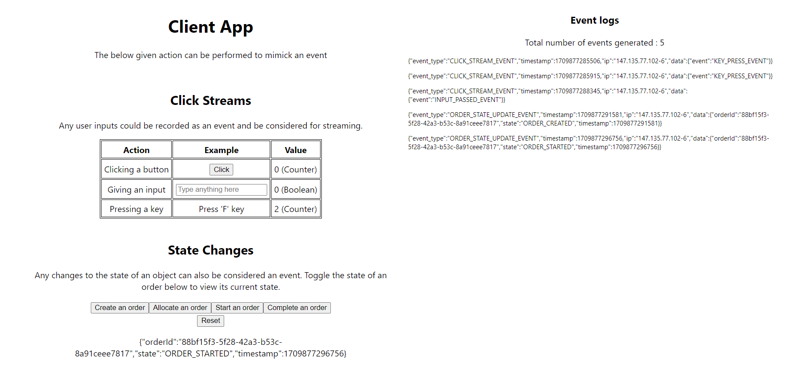

# ESE Client

This is the client-facing part of the Event-Streaming Example. This repo can be used to understand what type of events would be produced by our front end and can also be used to simulate them in large numbers.

- **Language :** [Javascript](https://developer.mozilla.org/en-US/docs/Web/javascript)
- **Library :** [React](https://react.dev/reference/react)



---

## Running via Docker

For the Standalone app (with the UI), the static files would be served from a NGINX server. Set the desired configs in the `.env` file before running the below commands.

```bash
docker run -d -p 8080:80 --env-file .env --name ese-client-container saumyabhatt10642/ese-client

// to run the simulation
docker run -it --env-file .env --name ese-client-simulator-container saumyabhatt10642/ese-client:simulate
```

---

## Running Locally

Set the desired configs in the `.env` file before running the below commands.

```bash
npm install
npm run start       // to run the client in the browser
npm run simulate    // to run the client in simulation
```

---

## Pushing image

Pushing any changes to the master will automatically trigger a GitHub action to push the docker images `latest` and `simulate` to DockerHub. If however one needs to push an image with a different tag, they may do so by running the below given commands:

[DockerHub Repository](https://hub.docker.com/repository/docker/saumyabhatt10642/ese-client/general)

```bash
docker image build -t ese-client:tag .
docker image tag ese-client:tag saumyabhatt10642/ese-client:tag
docker push saumyabhatt10642/ese-client:tag
```
